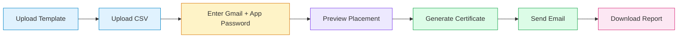

<div align="center">

# Certi Sender

**Generate personalized certificates and email them to hundreds of participants — in one click.**

Upload a template · Upload a CSV · Enter Gmail · Relax while emails go out automatically.

<br>

[](https://www.python.org/)
[](https://streamlit.io/)
[](LICENSE)
[](https://myaccount.google.com/apppasswords)

<br>

[Quick Start](#-quick-start) ·
[How It Works](#-how-it-works) ·
[Deploy Live](#-deploy-live-on-streamlit-cloud) ·
[CSV Format](#-csv-format) ·
[FAQ](#-faq)

</div>

---

## Why Certi Sender?

Event organizers shouldn't spend hours manually editing certificate names, exporting PNGs, and copy-pasting emails one by one.

**Certi Sender** is a minimal, production-ready web app that:

- Takes your **certificate template** and a **participants CSV**
- **Automatically places each name** on the certificate (no manual X/Y tweaking)
- **Sends personalized emails** with the certificate attached
- Tracks progress and gives you a **downloadable report** when done

Built for college fests, IEEE events, workshops, hackathons, and any scenario where you need to deliver certificates at scale.

---

## Preview

```
┌──────────────────────────────────────────────────────────────┐
│  📧  Certificate Mailer                                      │
├──────────────────────────────────────────────────────────────┤
│  1. Upload files                                             │
│     [ Certificate template (PNG/JPG) ]  [ Participants CSV ] │
│                                                              │
│  2. Email settings                                           │
│     Gmail address · App Password · Subject · Message         │
│                                                              │
│  3. Preview placement                                        │
│     Sample name → verify auto-positioning before sending     │
│                                                              │
│  4. Send certificates                                        │
│     [ Send all certificates ]                                │
│     Processing 45/120: Rahul Patel → sent                      │
└──────────────────────────────────────────────────────────────┘
```

---

## Features

| Feature | Description |
|--------|-------------|
| **Smart name placement** | Detects the underline on your template and centers the name above it |
| **Auto font sizing** | Long names shrink automatically so nothing overflows |
| **CSV-driven emails** | Uses the **Email column from your CSV** — no enrollment-number hacks |
| **Preview mode** | Test one certificate before sending to everyone |
| **Gmail ready** | Works with Gmail App Passwords via secure SMTP |
| **Progress tracking** | Live status for each participant as emails go out |
| **Send report** | Download a CSV of sent / failed results when finished |
| **Zero config storage** | Credentials are never saved — used only for your session |

---

## How It Works



### Automatic name placement (no manual offsets)

Most participation certificates have a **horizontal underline** where the recipient's name belongs. Certi Sender:

1. **Scans** the middle band of your template for that underline
2. **Centers** the participant name directly above it
3. **Shrinks the font** if the name is wider than ~82% of the certificate
4. **Falls back** to a smart default position if no underline is detected

> Use **Preview placement** in the app to verify positioning once per template before bulk sending.

---

## Quick Start

### 1. Clone the repository

```bash
git clone https://github.com/choksi2212/certi-sender.git
cd certi-sender
```

### 2. Install dependencies

```bash
pip install -r requirements.txt
```

### 3. Run the app

```bash
streamlit run app.py
```

Open the local URL shown in your terminal (usually `http://localhost:8501`).

### 4. Send certificates

1. Upload your certificate **template image** (PNG or JPG)
2. Upload your **participants CSV** (see format below)
3. Enter your **Gmail address** and **App Password**
4. Click **Preview placement** to verify one name
5. Click **Send all certificates** and wait for the progress bar to finish
6. Download the **report CSV** for your records

---

## CSV Format

Your CSV must include participant **names** and **emails**. A sample file is included at [`sample_participants.csv`](sample_participants.csv).

```csv
Name,Email
Alex Johnson,alex.johnson@example.com
Sam Rivera,sam.rivera@example.com
Priya Sharma,priya.sharma@example.com
```

### Supported column names

| Field | Accepted column headers |
|-------|-------------------------|
| **Name** | `Name`, `Name of Student`, `Student Name`, `Participant Name` |
| **Email** | `Email`, `E-mail`, `Email Address`, `Mail` |

> **Note:** Emails are read **directly from the CSV**. The app does not construct addresses from enrollment numbers.

---

## Gmail Setup

Certi Sender uses Gmail SMTP. You need an **App Password**, not your regular Gmail password.

| Step | Action |
|------|--------|
| 1 | Enable **2-Step Verification** on your Google account |
| 2 | Go to [Google App Passwords](https://myaccount.google.com/apppasswords) |
| 3 | Create a new app password (choose "Mail" / "Other") |
| 4 | Copy the 16-character password into the app |

**Daily limit:** Gmail allows roughly **500 emails/day** for standard accounts. The app includes a configurable delay between sends to stay within safe limits.

---

## Deploy Live on Streamlit Cloud

GitHub stores your code. **Streamlit Cloud** runs the live app (GitHub Pages cannot send email).

### Step-by-step deployment

| # | Step |
|---|------|
| 1 | Push this repo to GitHub (already done if you're reading this from the repo) |
| 2 | Visit [share.streamlit.io](https://share.streamlit.io) and sign in with GitHub |
| 3 | Click **New app** |
| 4 | Select repository: `choksi2212/certi-sender` |
| 5 | Set **Main file path** to `app.py` |
| 6 | Click **Deploy** |

Your live app will be available at:

```
https://certi-sender.streamlit.app
```

(or a custom subdomain you choose during setup)

---

## Project Structure

```
certi-sender/
├── app.py                    # Streamlit web interface
├── cert_utils.py             # Certificate generation + smart placement
├── email_utils.py            # CSV parsing + Gmail SMTP delivery
├── requirements.txt          # Python dependencies
├── sample_participants.csv   # Example CSV for testing
├── .gitignore
└── README.md
```

---

## Configuration

| Setting | Default | Description |
|---------|---------|-------------|
| Delay between emails | 4 seconds | Prevents Gmail rate limiting |
| Max text width | 82% of template | Auto font sizing boundary |
| Email subject | Customizable in UI | Default: "Certificate of Participation" |
| Email body | Customizable in UI | Use `{name}` for participant name |

---

## Security

| Principle | Detail |
|-----------|--------|
| **No credential storage** | Gmail credentials are used only during your active session |
| **No database** | Uploaded files are processed in memory for that run |
| **HTTPS on deploy** | Streamlit Cloud serves your app over HTTPS |
| **App Passwords** | Always use a Gmail App Password — never your main password |

For internal/college club use, consider running locally or restricting access to your deployed Streamlit app.

---

## FAQ

<details>
<summary><strong>Do I need to manually adjust name position on the certificate?</strong></summary>

No. The app detects the underline on your template and places names automatically. Use **Preview placement** once to confirm it looks correct for your specific design.
</details>

<details>
<summary><strong>Can I use college emails like 2200123456@mbit.edu.in?</strong></summary>

Yes — put the full email in your CSV. The app sends to whatever email address you provide in the Email column.
</details>

<details>
<summary><strong>What if some emails fail?</strong></summary>

Failed sends appear in the final summary and in the downloadable report CSV with the error message for each row.
</details>

<details>
<summary><strong>Can I customize the email message?</strong></summary>

Yes. Edit the subject and body in the app. Include `{name}` in the body and it will be replaced with each participant's name.
</details>

<details>
<summary><strong>Does this work with Outlook or Yahoo?</strong></summary>

Currently optimized for **Gmail SMTP**. Outlook/Yahoo support can be added by changing SMTP settings in `email_utils.py`.
</details>

---

## Troubleshooting

| Problem | Solution |
|---------|----------|
| Gmail login failed | Confirm 2FA is on and you're using an App Password |
| Certificate missing name / wrong position | Click **Preview placement**; ensure template has a visible underline or standard layout |
| CSV errors | Check that Name and Email columns exist and every row has a valid email |
| Emails going to spam | Ask recipients to check spam; send from an official college/org Gmail |
| App slow on first run | Font file is downloaded once and cached automatically |

---

## Tech Stack

- **[Streamlit](https://streamlit.io/)** — Web UI
- **[Pillow](https://python-pillow.org/)** — Image processing & certificate generation
- **`smtplib`** — Email delivery via Gmail SMTP
- **[Poppins Bold](https://fonts.google.com/specimen/Poppins)** — Default certificate font (auto-downloaded)

---

## Contributing

Contributions, issues, and feature requests are welcome.

1. Fork the repository
2. Create a feature branch (`git checkout -b feature/amazing-feature`)
3. Commit your changes
4. Push to the branch
5. Open a Pull Request

---

## License

This project is licensed under the **MIT License** — free to use, modify, and deploy.

---

<div align="center">

**Built for organizers who'd rather celebrate the event than fight with mail merge.**

<br>

[Report Bug](https://github.com/choksi2212/certi-sender/issues) · [Request Feature](https://github.com/choksi2212/certi-sender/issues) · [Deploy on Streamlit](https://share.streamlit.io)

<br>

⭐ Star this repo if Certi Sender saved you hours of manual work.

</div>
